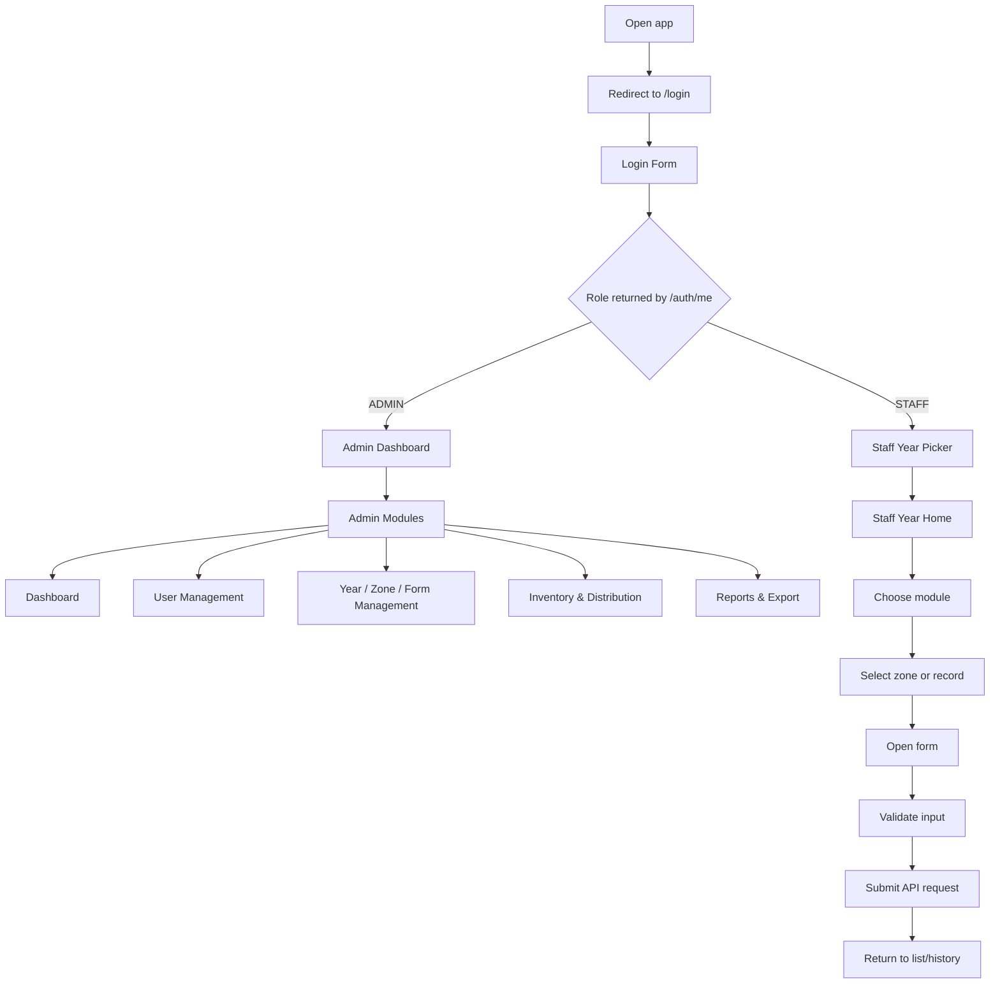

# Frontend Functions Documentation

## 1. Frontend Project Overview

This frontend is a Next.js App Router application for a product management system with two major user experiences:

- Admin workflows for dashboard analytics, user management, year/zone/form administration, inventory and warehouse operations, and report export.
- Staff workflows for recording field data by year, browsing records, and submitting or editing production forms.

### Technology Stack

- Next.js App Router
- React 19
- TypeScript
- Tailwind CSS 4
- shadcn/ui-style component primitives
- React Hook Form
- Zod validation
- Zustand for auth state
- TanStack React Query is installed, but the inspected codebase does not appear to use it heavily yet
- Recharts for charts
- Axios is installed, but the inspected code primarily uses `fetch`

### Architecture Summary

The app follows a thin-route, component-heavy architecture:

- Route pages in `app/` fetch backend data and assemble the correct screen.
- Reusable feature components in `components/custom/` handle forms, tables, dialogs, filters, cards, and charts.
- Shared UI primitives in `components/ui/` provide consistent inputs, buttons, dialogs, tables, tabs, cards, and form wrappers.
- API calls are centralized in `lib/server-actions/` and `lib/server-actions/admin/`, which wrap `fetch` against `baseUrl`.
- Route-level auth protection is enforced in `app/(protected)/*` layouts and in `proxy.ts`.
- Auth state is shared through Zustand in `lib/store/user-store.ts`.

### Folder Structure

- `app/`: Route definitions, layouts, redirects, and page shells.
- `components/`: Feature components and reusable UI primitives.
- `lib/`: Utilities, server-action helpers, type models, and shared state.
- `mock/`: Local mock JSON data used by some components and types.
- `public/`: Static assets such as logos and staff form images.

## 2. Application Structure

### `app/`

Purpose:

- Defines every route in the application.
- Fetches data on the server when needed, then passes it into client components.
- Organizes the app into auth, protected, admin, and staff route groups.

Important files:

- [app/layout.tsx](app/layout.tsx)
- [app/page.tsx](app/page.tsx)
- [app/(auth)/login/page.tsx](app/%28auth%29/login/page.tsx)
- [app/(protected)/layout.tsx](app/%28protected%29/layout.tsx)
- [app/(protected)/admin/layout.tsx](app/%28protected%29/admin/layout.tsx)
- [app/(protected)/staff/layout.tsx](app/%28protected%29/staff/layout.tsx)

Responsibility:

- Route composition.
- Permission checks.
- Server-side data fetching for route entry points.
- Passing selected year, role, and dataset props into client components.

### `components/`

Purpose:

- Houses reusable UI building blocks and feature-specific components.

Important files:

- `components/ui/`: base primitives for buttons, cards, dialogs, tables, tabs, forms, inputs, selects, alerts, labels, calendars, and popovers.
- `components/custom/admin/`: admin dashboard, user management, zone management, year management, inventory and distribution, report export.
- `components/custom/staff/`: staff navigation, search, history cards, and recording forms.
- `components/custom/common/`: shared form controls, error handling, buttons, date pickers, and titles.
- `components/custom/form/login-form.tsx`: login form.
- `components/custom/login/login-photo.tsx`: login page image panel.

Responsibility:

- Encapsulate all user interactions.
- Keep forms, modals, tables, and charts reusable.
- Hide UI details from route files.

### `hooks/`

Purpose:

- There is no dedicated `hooks/` directory in the inspected workspace.

Responsibility:

- Any local state behavior is implemented directly inside components or route layouts.

### `lib/`

Purpose:

- Shared constants, utility helpers, auth state, type models, and API wrappers.

Important files:

- [lib/utl.ts](lib/utl.ts)
- [lib/utils.ts](lib/utils.ts)
- [lib/store/user-store.ts](lib/store/user-store.ts)
- [lib/types/model/type.ts](lib/types/model/type.ts)
- [lib/types/model/function.ts](lib/types/model/function.ts)
- [lib/types/model/account.ts](lib/types/model/account.ts)
- [lib/types/model/option.ts](lib/types/model/option.ts)
- [lib/server-actions/](lib/server-actions)

Responsibility:

- Backend base URL and export metadata.
- Shared auth state.
- Zod schemas and TypeScript contracts.
- API helper functions used by forms and page shells.

### `types/`

Purpose:

- Type models live under `lib/types/model/` rather than a top-level `types/` folder.

Responsibility:

- Define the form payloads, API responses, option lists, and domain data structures used across the frontend.

### `utils/`

Purpose:

- There is no standalone top-level `utils/` folder in the inspected workspace.

Responsibility:

- Utility behavior is centralized in [lib/utils.ts](lib/utils.ts) and [lib/types/model/function.ts](lib/types/model/function.ts).

## 3. Pages and Routes Documentation

### Root Redirect

Page Name:

Root Redirect

Location:

[app/page.tsx](app/page.tsx)

Purpose:

- Redirects the application root to `/login`.

Functions:

- No visible UI.
- Uses `redirect("/login")` from `next/navigation`.

### Login Page

Page Name:

Login Page

Location:

[app/(auth)/login/page.tsx](app/%28auth%29/login/page.tsx)

Purpose:

- Presents the authentication entry screen.

Functions:

- Renders [LoginForm](components/custom/form/login-form.tsx) and [LoginPhoto](components/custom/login/login-photo.tsx).
- Splits login into an input panel and visual panel.

### Protected Layout

Page Name:

Protected Layout

Location:

[app/(protected)/layout.tsx](app/%28protected%29/layout.tsx)

Purpose:

- Validates that a user is authenticated before showing protected routes.

Functions:

- Fetches `/auth/me`.
- Stores the current user in Zustand.
- Redirects to `/login` when authentication fails.

### Admin Layout

Page Name:

Admin Shell

Location:

[app/(protected)/admin/layout.tsx](app/%28protected%29/admin/layout.tsx)

Purpose:

- Enforces admin-only access and provides the admin navigation shell.

Functions:

- Fetches `/auth/me`.
- Verifies the role is `ADMIN`.
- Renders the header, menu, and language switch.
- Wraps admin routes in a consistent layout.

### Staff Layout

Page Name:

Staff Shell

Location:

[app/(protected)/staff/layout.tsx](app/%28protected%29/staff/layout.tsx)

Purpose:

- Enforces staff-only access.

Functions:

- Fetches `/auth/me`.
- Verifies the role is `STAFF`.
- Renders the protected staff children.

### Admin Dashboard Entry

Page Name:

Admin Dashboard

Location:

[app/(protected)/admin/page.tsx](app/%28protected%29/admin/page.tsx)

Purpose:

- Serves as the dashboard landing page.

Functions:

- Reads the `tab` query parameter.
- Switches between overview, production, yield, and quality dashboard content.
- Uses [DashboardTabSelection](components/custom/admin/dashboard/tab-selection.tsx).

### Dashboard Overview

Page Name:

Overview Dashboard

Location:

[app/(protected)/admin/(modules)/dashboard/overview/page.tsx](app/%28protected%29/admin/%28modules%29/dashboard/overview/page.tsx)

Purpose:

- Displays high-level KPI cards and production charts.

Functions:

- Shows mock KPI metrics for the current year.
- Renders chart components for production stage health, flower production, and production metrics.

### User Management

Page Name:

User Management

Location:

[app/(protected)/admin/(modules)/user-management/page.tsx](app/%28protected%29/admin/%28modules%29/user-management/page.tsx)

Purpose:

- Loads the user list for admin management.

Functions:

- Fetches `/accounts/get-all` with cookies.
- Maps API results into `Account` records.
- Passes the data into [User-Management-Page-Client](app/%28protected%29/admin/%28modules%29/user-management/User-Management-Page-Client.tsx).

### Year Management

Page Name:

Year Management

Location:

[app/(protected)/admin/(modules)/year-management/page.tsx](app/%28protected%29/admin/%28modules%29/year-management/page.tsx)

Purpose:

- Displays year records and year-level configuration.

Functions:

- Fetches `/years/get-year-management-table`.
- Converts API year objects into table rows.
- Passes them to [Year-Management-Page-Client](app/%28protected%29/admin/%28modules%29/year-management/Year-Management-Page-Client.tsx).

### Zone and Form Management

Page Name:

Zone and Form Management Layout

Location:

[app/(protected)/admin/(modules)/zone-form-management/(withLayout)/layout.tsx](<app/%28protected%29/admin/%28modules%29/zone-form-management/(withLayout)/layout.tsx>)

Purpose:

- Loads the year list and provides the shared year-driven zone/form shell.

Functions:

- Fetches `/years/get-all-years`.
- Wraps nested zone and form routes in [Zone-Management-Page-Client](<app/%28protected%29/admin/%28modules%29/zone-form-management/(withLayout)/%5Byear%5D/zone/Zone-Management-Page-Client.tsx>) and [Form-Management-Page-Client](<app/%28protected%29/admin/%28modules%29/zone-form-management/(withLayout)/%5Byear%5D/form/Form-Management-Page-Client.tsx>).

Page Name:

Zone Management by Year

Location:

[app/(protected)/admin/(modules)/zone-form-management/(withLayout)/[year]/zone/page.tsx](<app/%28protected%29/admin/%28modules%29/zone-form-management/(withLayout)/%5Byear%5D/zone/page.tsx>)

Purpose:

- Shows zones for a selected year.

Functions:

- Fetches `/zones/get-zone-management-table?year=...`.
- Passes zone data to the zone management client.

Page Name:

Form Management by Year

Location:

[app/(protected)/admin/(modules)/zone-form-management/(withLayout)/[year]/form/page.tsx](<app/%28protected%29/admin/%28modules%29/zone-form-management/(withLayout)/%5Byear%5D/form/page.tsx>)

Purpose:

- Shows which recording forms are active for a year.

Functions:

- Fetches `/years/get-year-setting?year=...`.
- Passes form configuration into the form management client.

Page Name:

Zone Details Branch

Location:

[app/(protected)/admin/(modules)/zone-form-management/zone-details/[zoneId]/page.tsx](app/%28protected%29/admin/%28modules%29/zone-form-management/zone-details/%5BzoneId%5D/page.tsx)

Purpose:

- Redirects into the zone detail sub-sections.

Functions:

- Routes into child pages for cluster, flower, pollination, pod, pre-harvest, and harvest-grading views.

### Inventory and Distribution

Page Name:

Inventory and Distribution Layout

Location:

[app/(protected)/admin/(modules)/inventory-distribution/layout.tsx](app/%28protected%29/admin/%28modules%29/inventory-distribution/layout.tsx)

Purpose:

- Loads year choices and provides the inventory/year shell.

Functions:

- Fetches `/years/get-all-years`.
- Wraps inventory child routes in [InventoryLayoutClient](app/%28protected%29/admin/%28modules%29/inventory-distribution/inventory-layout-client.tsx).

Page Name:

Inventory Overview

Location:

[app/(protected)/admin/(modules)/inventory-distribution/page.tsx](app/%28protected%29/admin/%28modules%29/inventory-distribution/page.tsx)

Purpose:

- Displays overview cards for the inventory module.

Functions:

- Renders [StockOverviewCards](components/custom/admin/inventory%26distribution/stock-overview-card.tsx), [GradeGraph](components/custom/admin/inventory%26distribution/grade-graph.tsx), [GradeSummary](components/custom/admin/inventory%26distribution/grade-summary-card.tsx), and [StockMovementGraph](components/custom/admin/inventory%26distribution/stock-movement-graph.tsx).

Page Name:

Warehouse Page

Location:

[app/(protected)/admin/(modules)/inventory-distribution/[year]/warehouse/page.tsx](app/%28protected%29/admin/%28modules%29/inventory-distribution/%5Byear%5D/warehouse/page.tsx)

Purpose:

- Displays warehouse data for a year.

Functions:

- Fetches `/warehouses/get-warehouse-table-by-year?year=...`.
- Renders [Warehouse-Page-Client](app/%28protected%29/admin/%28modules%29/inventory-distribution/%5Byear%5D/warehouse/Warehouse-Page-Client.tsx).

Page Name:

Distribution Page

Location:

[app/(protected)/admin/(modules)/inventory-distribution/[year]/distribution/page.tsx](app/%28protected%29/admin/%28modules%29/inventory-distribution/%5Byear%5D/distribution/page.tsx)

Purpose:

- Presents stock distribution entry and overview controls.

Functions:

- Fetches the year list and renders the distribution client.

Page Name:

Distribution History Page

Location:

[app/(protected)/admin/(modules)/inventory-distribution/[year]/history/page.tsx](app/%28protected%29/admin/%28modules%29/inventory-distribution/%5Byear%5D/history/page.tsx)

Purpose:

- Shows historical stock movement records.

Functions:

- Fetches `/stocks/get-all-by-year?year=...`.
- Passes the records to [history-page-client](app/%28protected%29/admin/%28modules%29/inventory-distribution/%5Byear%5D/history/history-page-client.tsx).

Page Name:

Customer Management Page

Location:

[app/(protected)/admin/(modules)/inventory-distribution/[year]/customer/page.tsx](app/%28protected%29/admin/%28modules%29/inventory-distribution/%5Byear%5D/customer/page.tsx)

Purpose:

- Shows customer stock data for a year.

Functions:

- Fetches `/stocks/get-customer-stock-by-year?year=...`.
- Passes data to the customer management client.

### Reports and Export

Page Name:

Reports Export

Location:

[app/(protected)/admin/(modules)/reports-export/page.tsx](app/%28protected%29/admin/%28modules%29/reports-export/page.tsx)

Purpose:

- Provides export actions for reports by year.

Functions:

- Fetches `/years/get-all-years`.
- Passes the year list to [reports-export-page-client](app/%28protected%29/admin/%28modules%29/reports-export/reports-export-page-client.tsx).

### Staff Entry and Year Selection

Page Name:

Staff Entry Page

Location:

[app/(protected)/staff/page.tsx](app/%28protected%29/staff/page.tsx)

Purpose:

- Shows the year picker entry point for staff users.

Functions:

- Renders [StaffYearDialog](components/custom/staff/year-select.tsx).

Page Name:

Staff Year Home

Location:

[app/(protected)/staff/[year]/page.tsx](app/%28protected%29/staff/%5Byear%5D/page.tsx)

Purpose:

- Displays the staff feature tiles for a selected year.

Functions:

- Links into cluster, flower, pollination, pod, pre-harvest, and harvest-grading modules.

### Staff Module List Pages

Page Name:

Cluster List

Location:

[app/(protected)/staff/[year]/(modules)/cluster/page.tsx](app/%28protected%29/staff/%5Byear%5D/%28modules%29/cluster/page.tsx)

Purpose:

- Lists cluster records for the selected year and zone.

Functions:

- Fetches zones for the year.
- Renders [ClusterPageClient](app/%28protected%29/staff/%5Byear%5D/%28modules%29/cluster/ClusterPageClient.tsx).

Page Name:

Flower List

Location:

[app/(protected)/staff/[year]/(modules)/flower/page.tsx](app/%28protected%29/staff/%5Byear%5D/%28modules%29/flower/page.tsx)

Purpose:

- Lists flower records for the selected year and zone.

Page Name:

Pollination List

Location:

[app/(protected)/staff/[year]/(modules)/pollination/page.tsx](app/%28protected%29/staff/%5Byear%5D/%28modules%29/pollination/page.tsx)

Purpose:

- Lists pollination records for the selected year and zone.

Page Name:

Pod List

Location:

[app/(protected)/staff/[year]/(modules)/pod/page.tsx](app/%28protected%29/staff/%5Byear%5D/%28modules%29/pod/page.tsx)

Purpose:

- Lists pod records for the selected year and zone.

Page Name:

Pre-Harvest List

Location:

[app/(protected)/staff/[year]/(modules)/pre-harvest/page.tsx](app/%28protected%29/staff/%5Byear%5D/%28modules%29/pre-harvest/page.tsx)

Purpose:

- Lists pre-harvest records for the selected year and zone.

Page Name:

Harvest Grading List

Location:

[app/(protected)/staff/[year]/(modules)/harvest-grading/page.tsx](app/%28protected%29/staff/%5Byear%5D/%28modules%29/harvest-grading/page.tsx)

Purpose:

- Lists harvest grading records by zone.

### Staff Form Pages

Page Name:

Cluster Form Create

Location:

[app/(protected)/staff/[year]/(modules)/cluster/cluster-form/page.tsx](app/%28protected%29/staff/%5Byear%5D/%28modules%29/cluster/cluster-form/page.tsx)

Purpose:

- Creates a new cluster record.

Functions:

- Loads the selected zone and submits cluster data through `createCluster`.

Page Name:

Cluster Form Edit

Location:

[app/(protected)/staff/[year]/(modules)/cluster/[formId]/cluster-form-edit/page.tsx](app/%28protected%29/staff/%5Byear%5D/%28modules%29/cluster/%5BformId%5D/cluster-form-edit/page.tsx)

Purpose:

- Edits an existing cluster record.

Page Name:

Flower Form

Location:

[app/(protected)/staff/[year]/(modules)/flower/[formId]/flower-form/page.tsx](app/%28protected%29/staff/%5Byear%5D/%28modules%29/flower/%5BformId%5D/flower-form/page.tsx)

Purpose:

- Records flower totals for a cluster.

Page Name:

Pollination Form

Location:

[app/(protected)/staff/[year]/(modules)/pollination/[formId]/pollination-form/page.tsx](app/%28protected%29/staff/%5Byear%5D/%28modules%29/pollination/%5BformId%5D/pollination-form/page.tsx)

Purpose:

- Records pollination results for a cluster.

Page Name:

Pod Form

Location:

[app/(protected)/staff/[year]/(modules)/pod/[formId]/pod-form/page.tsx](app/%28protected%29/staff/%5Byear%5D/%28modules%29/pod/%5BformId%5D/pod-form/page.tsx)

Purpose:

- Records pod loss and calculates remaining pods.

Page Name:

Pre-Harvest Form

Location:

[app/(protected)/staff/[year]/(modules)/pre-harvest/[formId]/pre-harvest-form/page.tsx](app/%28protected%29/staff/%5Byear%5D/%28modules%29/pre-harvest/%5BformId%5D/pre-harvest-form/page.tsx)

Purpose:

- Records second-round pod counts and pre-harvest removals.

Page Name:

Harvest Grading Form

Location:

[app/(protected)/staff/[year]/(modules)/harvest-grading/[poleId]/harvest-grading-form/page.tsx](app/%28protected%29/staff/%5Byear%5D/%28modules%29/harvest-grading/%5BpoleId%5D/harvest-grading-form/page.tsx)

Purpose:

- Records harvest grading counts and weights by grade.

### Staff History Pages

Page Name:

Staff History Landing

Location:

[app/(protected)/staff/[year]/history/page.tsx](app/%28protected%29/staff/%5Byear%5D/history/page.tsx)

Purpose:

- Shows history module shortcuts.

Page Name:

History Cluster

Location:

[app/(protected)/staff/[year]/history/(modules)/cluster/page.tsx](app/%28protected%29/staff/%5Byear%5D/history/%28modules%29/cluster/page.tsx)

Purpose:

- Shows historical cluster forms.

Page Name:

History Flower

Location:

[app/(protected)/staff/[year]/history/(modules)/flower/page.tsx](app/%28protected%29/staff/%5Byear%5D/history/%28modules%29/flower/page.tsx)

Purpose:

- Shows historical flower forms.

Page Name:

History Pollination

Location:

[app/(protected)/staff/[year]/history/(modules)/pollination/page.tsx](app/%28protected%29/staff/%5Byear%5D/history/%28modules%29/pollination/page.tsx)

Purpose:

- Shows historical pollination forms.

Page Name:

History Pod

Location:

[app/(protected)/staff/[year]/history/(modules)/pod/page.tsx](app/%28protected%29/staff/%5Byear%5D/history/%28modules%29/pod/page.tsx)

Purpose:

- Shows historical pod forms.

Page Name:

History Pre-Harvest

Location:

[app/(protected)/staff/[year]/history/(modules)/pre-harvest/page.tsx](app/%28protected%29/staff/%5Byear%5D/history/%28modules%29/pre-harvest/page.tsx)

Purpose:

- Shows historical pre-harvest forms.

Page Name:

History Harvest Grading

Location:

[app/(protected)/staff/[year]/history/(modules)/harvest-grading/page.tsx](app/%28protected%29/staff/%5Byear%5D/history/%28modules%29/harvest-grading/page.tsx)

Purpose:

- Shows historical harvest grading forms.

## 4. Component Documentation

### Component: LoginForm

File:

[components/custom/form/login-form.tsx](components/custom/form/login-form.tsx)

Purpose:

- Handles authentication entry for all users.

Props:

- None.

Functionality:

- Validates email and password with Zod.
- Submits credentials to `/auth/login`.
- Fetches `/auth/me` after successful login.
- Stores user data in Zustand.
- Redirects admins to `/admin` and staff to `/staff`.

### Component: ToolBar

File:

[components/custom/admin/toolBar.tsx](components/custom/admin/toolBar.tsx)

Purpose:

- Provides user search and create-user actions.

Props:

- `onSearch`
- `onCreate`

Functionality:

- Captures a search keyword.
- Invokes parent search on Enter or button click.
- Opens the create-user modal through the parent callback.

### Component: UsersTable

File:

[components/custom/admin/users-table.tsx](components/custom/admin/users-table.tsx)

Purpose:

- Displays users in a table with edit and password actions.

Props:

- `users`

Functionality:

- Renders user rows, role badges, and active/inactive status chips.
- Opens [EditUserModal](components/custom/admin/edit-user-modal.tsx) and [ChangePasswordModal](components/custom/admin/change-password-modal.tsx).
- Shows an empty state when no users exist.

### Component: CreateUserModal

File:

[components/custom/admin/create-user-modal.tsx](components/custom/admin/create-user-modal.tsx)

Purpose:

- Creates a new admin or staff account.

Props:

- `isOpen`
- `onClose`

Functionality:

- Validates name, email, password, role, status, and phone number.
- Calls `createUser`.
- Closes on success and refreshes the route.

### Component: EditUserModal

File:

[components/custom/admin/edit-user-modal.tsx](components/custom/admin/edit-user-modal.tsx)

Purpose:

- Updates user profile information.

Props:

- `isOpen`
- `onClose`
- `account`

Functionality:

- Resets form values from the selected account.
- Updates user info through `updateUserInfo`.
- Refreshes the route on success.

### Component: ChangePasswordModal

File:

[components/custom/admin/change-password-modal.tsx](components/custom/admin/change-password-modal.tsx)

Purpose:

- Changes a user password from the admin UI.

Props:

- `isOpen`
- `onClose`
- `user`

Functionality:

- Validates password confirmation.
- Sends the update via `updateUserPassword`.
- Closes and resets the form on success.

### Component: AdminCustomTabs

File:

[components/custom/admin/admin-custom-tabs.tsx](components/custom/admin/admin-custom-tabs.tsx)

Purpose:

- Provides a consistent tab bar for admin screens.

Props:

- `tabs`
- `value`
- `onValueChange`
- `defaultValue`
- `children`

Functionality:

- Wraps Radix tabs primitives.
- Renders icon-aware tab triggers.

### Component: StatusCard

File:

[components/custom/admin/statusCard.tsx](components/custom/admin/statusCard.tsx)

Purpose:

- Shows a KPI summary value in a card format.

Props:

- `icon`
- `value`
- `label`

Functionality:

- Displays one large number and its label.

### Component: StockOverviewCards

File:

[components/custom/admin/inventory&distribution/stock-overview-card.tsx](components/custom/admin/inventory%26distribution/stock-overview-card.tsx)

Purpose:

- Presents inventory overview metrics and stock movement summaries.

Functionality:

- Composes stock metric cards and movement items.
- Serves as the top-level inventory overview block.

### Component: WareHouse

File:

[components/custom/admin/inventory&distribution/warehouse.tsx](components/custom/admin/inventory%26distribution/warehouse.tsx)

Purpose:

- Provides warehouse search and warehouse creation UI.

Functionality:

- Searches warehouses by name.
- Opens an add-warehouse dialog.
- Calls `createWareHouse` and redirects back to the warehouse page.

### Component: InventorySaleForm

File:

[components/custom/admin/inventory&distribution/inventory-sale-form.tsx](components/custom/admin/inventory%26distribution/inventory-sale-form.tsx)

Purpose:

- Records carry-over, incoming, and issued inventory transactions.

Functionality:

- Collects year, area, category, grade, amount, pod count, optional price, and customer.
- Resets dependent fields when the category changes.
- Calls `createCarryOver`, `createIncoming`, or `createIssued` based on the selected category.
- Redirects to the history screen after success.

### Component: ClusterSearch

File:

[components/custom/staff/cluster-search.tsx](components/custom/staff/cluster-search.tsx)

Purpose:

- Filters cluster records by location, pole, cluster, and status.

Functionality:

- Drives staff module search behavior.

### Component: ClusterRecordingCard

File:

[components/custom/staff/cluster-recording-card.tsx](components/custom/staff/cluster-recording-card.tsx)

Purpose:

- Shows a cluster record with completion state and action affordances.

### Component: HarvestAndGradingSearch

File:

[components/custom/staff/harvest-grading-search.tsx](components/custom/staff/harvest-grading-search.tsx)

Purpose:

- Filters harvest-grading records by location and pole identifier.

### Component: HarvestGradingRecordingCard

File:

[components/custom/staff/harvest-grading-recording-card.tsx](components/custom/staff/harvest-grading-recording-card.tsx)

Purpose:

- Displays harvested grading history as a card.

### Component: FlowerRecordingForm

File:

[components/custom/staff/form/flower-recording-form.tsx](components/custom/staff/form/flower-recording-form.tsx)

Purpose:

- Records flower totals for a single cluster.

Functionality:

- Loads existing flower form data from `/flowers/get-flower-form?clusterId=...`.
- Resets the form when record data arrives.
- Submits through `createFlower`.

### Component: PollinationRecordingForm

File:

[components/custom/staff/form/pollination-recording-form.tsx](components/custom/staff/form/pollination-recording-form.tsx)

Purpose:

- Records pollination output for a cluster.

Functionality:

- Loads existing pollination data.
- Locks fields when the backend indicates a read-only state.
- Submits through `createPollination`.

### Component: PodRecordingForm

File:

[components/custom/staff/form/pod-recording-form.tsx](components/custom/staff/form/pod-recording-form.tsx)

Purpose:

- Records lost pods and calculates remaining pods.

Functionality:

- Prevents lost pods from exceeding total formed pods.
- Submits through `createPod`.

### Component: PreHarvestRecordingForm

File:

[components/custom/staff/form/pre-harvest-recording-form.tsx](components/custom/staff/form/pre-harvest-recording-form.tsx)

Purpose:

- Records pre-harvest second-round pod and removal counts.

Functionality:

- Submits through `createPreHarvestForm`.

### Component: HarvestGradingRecordingForm

File:

[components/custom/staff/form/harvest-grading-recording-form.tsx](components/custom/staff/form/harvest-grading-recording-form.tsx)

Purpose:

- Records grade-by-grade pod counts and weights.

Functionality:

- Validates all grade entry pairs.
- Submits through `createHarvestGrading`.

## 5. Form Documentation

### Form Name:

Login Form

Location:

[components/custom/form/login-form.tsx](components/custom/form/login-form.tsx)

Purpose:

- Collects login credentials.

Fields:

| Field    | Type   | Description        |
| -------- | ------ | ------------------ |
| email    | string | User email address |
| password | string | Account password   |

Validation:

- Email is required and must be valid.
- Password is required.

Submission Flow:

1. User enters credentials.
2. Zod validation runs through React Hook Form.
3. Form submits to `/auth/login`.
4. The app fetches `/auth/me`.
5. The user is routed to admin or staff home.

### Form Name:

Create User Form

Location:

[components/custom/admin/create-user-modal.tsx](components/custom/admin/create-user-modal.tsx)

Purpose:

- Creates a new account.

Fields:

| Field         | Type    | Description           |
| ------------- | ------- | --------------------- |
| name          | string  | Full name             |
| email         | string  | Login email           |
| password      | string  | Initial password      |
| role          | string  | `ADMIN` or `STAFF`    |
| active_status | boolean | Account status        |
| phone_no      | string  | Optional phone number |

Validation:

- Name must be letters and spaces only.
- Email must be valid.
- Password must be at least 6 characters.
- Role must be `ADMIN` or `STAFF`.
- Phone number is optional but must match the allowed pattern if provided.

Submission Flow:

1. User fills out the modal.
2. Validation runs.
3. `createUser` is called.
4. On success, the modal closes and the page refreshes.

### Form Name:

Edit User Form

Location:

[components/custom/admin/edit-user-modal.tsx](components/custom/admin/edit-user-modal.tsx)

Purpose:

- Edits user metadata.

Fields:

| Field         | Type   | Description               |
| ------------- | ------ | ------------------------- |
| name          | string | User name                 |
| email         | string | Email address             |
| role          | string | User role                 |
| active_status | string | Active or inactive status |
| phone_no      | string | Optional phone number     |

Validation:

- Same name/email/role/phone rules as create-user.
- Status is required.

Submission Flow:

1. Selected account data resets the form.
2. User edits the values.
3. Validation runs.
4. `updateUserInfo` is called.
5. On success, the modal closes and the page refreshes.

### Form Name:

Change Password Form

Location:

[components/custom/admin/change-password-modal.tsx](components/custom/admin/change-password-modal.tsx)

Purpose:

- Changes the selected user password.

Fields:

| Field           | Type   | Description           |
| --------------- | ------ | --------------------- |
| newPassword     | string | New password          |
| confirmPassword | string | Password confirmation |

Validation:

- Both fields require at least 6 characters.
- Both values must match.

Submission Flow:

1. User enters a new password twice.
2. Validation checks length and equality.
3. `updateUserPassword` is called.
4. On success, the form resets and the modal closes.

### Form Name:

Warehouse Form

Location:

[components/custom/admin/inventory&distribution/warehouse.tsx](components/custom/admin/inventory%26distribution/warehouse.tsx)

Purpose:

- Adds a warehouse record.

Fields:

| Field          | Type   | Description             |
| -------------- | ------ | ----------------------- |
| warehouse_name | string | Warehouse name          |
| active_status  | string | Active or inactive flag |

Validation:

- Validation is defined through `WareHouseFormSchema` in the type model file.

Submission Flow:

1. User opens the add warehouse dialog.
2. User enters warehouse data.
3. Validation runs.
4. `createWareHouse` submits the data.
5. On success, the dialog closes and the route refreshes to the warehouse page.

### Form Name:

Inventory Sale Form

Location:

[components/custom/admin/inventory&distribution/inventory-sale-form.tsx](components/custom/admin/inventory%26distribution/inventory-sale-form.tsx)

Purpose:

- Records stock movement entries.

Fields:

| Field          | Type   | Description                     |
| -------------- | ------ | ------------------------------- |
| date           | date   | Transaction date                |
| category       | string | Carry over, incoming, or issued |
| plantationYear | string | Source year                     |
| plantationArea | string | Warehouse or area               |
| numberOfPods   | string | Pod count                       |
| grade          | string | Grade label                     |
| amount         | string | Gram amount                     |
| Remarks        | string | Notes                           |
| pricePerGram   | string | Only for issued entries         |
| customer       | string | Only for issued entries         |

Validation:

- Controlled by `InventoryForm` and the related schema in the type model file.
- Some fields are conditionally required based on category.

Submission Flow:

1. User selects the transaction category.
2. The form resets dependent fields when the category changes.
3. Validation runs.
4. The correct API helper is called for the selected category.
5. On success, the user is redirected to history.

### Form Name:

Flower Recording Form

Location:

[components/custom/staff/form/flower-recording-form.tsx](components/custom/staff/form/flower-recording-form.tsx)

Purpose:

- Records flower totals for a cluster.

Fields:

| Field        | Type          | Description            |
| ------------ | ------------- | ---------------------- |
| totalFlowers | number/string | Total flowers recorded |
| condition    | string        | Cluster condition      |

Validation:

- Total flowers is required and must be numeric.
- Condition is required.

Submission Flow:

1. The page loads existing data for the cluster.
2. The form resets from backend data.
3. User edits fields.
4. `createFlower` submits the record.
5. User returns to the flower list.

### Form Name:

Pollination Recording Form

Location:

[components/custom/staff/form/pollination-recording-form.tsx](components/custom/staff/form/pollination-recording-form.tsx)

Purpose:

- Records pollination counts for a cluster.

Fields:

| Field                   | Type          | Description              |
| ----------------------- | ------------- | ------------------------ |
| numberPods              | number/string | Number of pods           |
| unsuccessfulPollination | number/string | Failed pollination count |
| condition               | string        | Cluster condition        |

Validation:

- Numeric fields must be numeric and non-negative.
- Condition is required.

Submission Flow:

1. Existing pollination data is loaded.
2. The form is reset with backend values.
3. User edits values unless read-only mode is active.
4. `createPollination` submits the data.
5. User returns to the pollination list.

### Form Name:

Pod Recording Form

Location:

[components/custom/staff/form/pod-recording-form.tsx](components/custom/staff/form/pod-recording-form.tsx)

Purpose:

- Records lost pods and calculates remaining pods.

Fields:

| Field     | Type   | Description         |
| --------- | ------ | ------------------- |
| lostPods  | string | Number of lost pods |
| condition | string | Cluster condition   |

Validation:

- Lost pods is required and must be numeric.
- Condition is required.
- Lost pods cannot exceed total formed pods.

Submission Flow:

1. Backend pod data is loaded.
2. The remaining pods value is derived locally.
3. Validation runs.
4. `createPod` submits the record.
5. User returns to the pod list.

### Form Name:

Pre-Harvest Recording Form

Location:

[components/custom/staff/form/pre-harvest-recording-form.tsx](components/custom/staff/form/pre-harvest-recording-form.tsx)

Purpose:

- Records the pre-harvest second-round state.

Fields:

| Field                 | Type   | Description              |
| --------------------- | ------ | ------------------------ |
| numberPodsSecondRound | string | Pods counted in round 2  |
| removedPods           | string | Pods removed             |
| plantsRemoved         | string | Plants with pods removed |
| condition             | string | Condition                |

Validation:

- All numeric fields must be numeric and non-empty.
- Condition is required.

Submission Flow:

1. Existing pre-harvest data is loaded.
2. The form is reset with backend values.
3. `createPreHarvestForm` is called on submit.
4. User returns to the pre-harvest list.

### Form Name:

Harvest Grading Recording Form

Location:

[components/custom/staff/form/harvest-grading-recording-form.tsx](components/custom/staff/form/harvest-grading-recording-form.tsx)

Purpose:

- Records grade-by-grade pod counts and weights.

Fields:

| Field                 | Type          | Description        |
| --------------------- | ------------- | ------------------ |
| gradeA_plus.podsCount | number/string | Grade A+ pod count |
| gradeA_plus.weight    | number/string | Grade A+ weight    |
| gradeA.podsCount      | number/string | Grade A pod count  |
| gradeA.weight         | number/string | Grade A weight     |
| gradeB.podsCount      | number/string | Grade B pod count  |
| gradeB.weight         | number/string | Grade B weight     |
| gradeC.podsCount      | number/string | Grade C pod count  |
| gradeC.weight         | number/string | Grade C weight     |
| gradeD_plus.podsCount | number/string | Grade D+ pod count |
| gradeD_plus.weight    | number/string | Grade D+ weight    |
| rejected.podsCount    | number/string | Rejected pod count |
| rejected.weight       | number/string | Rejected weight    |

Validation:

- Each pods count must be a whole number and non-negative.
- Each weight value must be numeric and non-negative.

Submission Flow:

1. Backend grade data is loaded.
2. The nested grade form is populated.
3. Validation runs for each grade bucket.
4. `createHarvestGrading` submits the complete grading payload.
5. User returns to the harvest grading list.

## 6. Hooks Documentation

### Hook:

`useAuthStore`

Purpose:

- Global auth state for the current user.

Parameters:

- None.

Returns:

- `user`
- `isAuthenticated`
- `isLoading`
- `setUser`
- `setLoading`
- `logout`

Usage:

- Used by protected layouts and the login form to store or read the logged-in user.

### Hook:

`useInventory`

Purpose:

- Local inventory year context.

Parameters:

- None.

Returns:

- `selectedYear`
- `setSelectedYear`

Usage:

- Used by inventory-distribution pages and components to keep the active year in sync.

### Hook:

`useZoneForm`

Purpose:

- Local zone/form year context.

Parameters:

- None.

Returns:

- `selectedYear`
- `setSelectedYear`

Usage:

- Used by zone/form management pages and components to keep the active year in sync.

## 7. API Integration (Frontend Side)

### Function:

`createUser()`

Location:

[lib/server-actions/admin/create-user-client.ts](lib/server-actions/admin/create-user-client.ts)

Purpose:

- Creates a user account.

Parameters:

- User creation form data.

Request data:

- Name, email, password, role, active status, phone number.

Response handling:

- Returns backend success or error payload.

Used by components:

- [CreateUserModal](components/custom/admin/create-user-modal.tsx)

### Function:

`updateUserInfo()`

Location:

[lib/server-actions/admin/update-user-info-client.ts](lib/server-actions/admin/update-user-info-client.ts)

Purpose:

- Updates user profile information.

Used by components:

- [EditUserModal](components/custom/admin/edit-user-modal.tsx)

### Function:

`updateUserPassword()`

Location:

[lib/server-actions/admin/update-user-password-client.ts](lib/server-actions/admin/update-user-password-client.ts)

Purpose:

- Updates a user's password.

Used by components:

- [ChangePasswordModal](components/custom/admin/change-password-modal.tsx)

### Function:

`createYear()`

Location:

[lib/server-actions/admin/create-year-client.ts](lib/server-actions/admin/create-year-client.ts)

Purpose:

- Creates a new year record.

Used by components:

- Year management creation UI.

### Function:

`updateYearSetting()`

Location:

[lib/server-actions/admin/update-year-setting-client.ts](lib/server-actions/admin/update-year-setting-client.ts)

Purpose:

- Updates active form settings for a year.

Used by components:

- [EditFormButton](components/custom/admin/zone&form/form/edit-form-button.tsx)

### Function:

`createZone()`

Location:

[lib/server-actions/admin/create-zone-client.ts](lib/server-actions/admin/create-zone-client.ts)

Purpose:

- Creates a zone for a year.

Used by components:

- [CreateOrEditZoneButton](components/custom/admin/zone&form/zone/create-new-zone-button.tsx)

### Function:

`updateZone()`

Location:

[lib/server-actions/admin/update-zone-name-client.ts](lib/server-actions/admin/update-zone-name-client.ts)

Purpose:

- Updates an existing zone name.

Used by components:

- [EditZoneButton](components/custom/admin/zone&form/edit-zone-button.tsx)

### Function:

`createWareHouse()`

Location:

[lib/server-actions/admin/create-warehouse-client.ts](lib/server-actions/admin/create-warehouse-client.ts)

Purpose:

- Creates a warehouse.

Used by components:

- [WareHouse](components/custom/admin/inventory&distribution/warehouse.tsx)

### Function:

`updateWareHouse()`

Location:

[lib/server-actions/admin/update-warehouse-client.ts](lib/server-actions/admin/update-warehouse-client.ts)

Purpose:

- Updates warehouse details.

Used by components:

- Warehouse edit modal.

### Function:

`createCustomer()`

Location:

[lib/server-actions/admin/create-customer-client.ts](lib/server-actions/admin/create-customer-client.ts)

Purpose:

- Creates a customer record.

Used by components:

- [AddCustomerButton](components/custom/admin/inventory&distribution/add-customer-button.tsx)

### Function:

`updateCustomerInfo()`

Location:

[lib/server-actions/admin/update-customer-info-client.ts](lib/server-actions/admin/update-customer-info-client.ts)

Purpose:

- Updates customer details.

Used by components:

- Customer edit modal.

### Function:

`createCarryOver()`

Location:

[lib/server-actions/admin/create-carry-over-client.ts](lib/server-actions/admin/create-carry-over-client.ts)

Purpose:

- Creates a carry-over stock movement.

Used by components:

- [InventorySaleForm](components/custom/admin/inventory&distribution/inventory-sale-form.tsx)

### Function:

`createIncoming()`

Location:

[lib/server-actions/admin/create-incoming-client.ts](lib/server-actions/admin/create-incoming-client.ts)

Purpose:

- Creates an incoming stock movement.

Used by components:

- [InventorySaleForm](components/custom/admin/inventory&distribution/inventory-sale-form.tsx)

### Function:

`createIssued()`

Location:

[lib/server-actions/admin/create-issued-client.ts](lib/server-actions/admin/create-issued-client.ts)

Purpose:

- Creates an issued stock movement.

Used by components:

- [InventorySaleForm](components/custom/admin/inventory&distribution/inventory-sale-form.tsx)

### Function:

`exportExcelFile()`

Location:

[lib/server-actions/admin/export-form-client.ts](lib/server-actions/admin/export-form-client.ts)

Purpose:

- Downloads report data from export endpoints.

Used by components:

- Reports export cards.

### Function:

`fetchWithCookie()`

Location:

[lib/server-actions/admin/fetch-with-cookie.ts](lib/server-actions/admin/fetch-with-cookie.ts)

Purpose:

- Generic GET helper that forwards cookies.

Used by components:

- Shared backend-fetch flows in admin helper code.

### Function:

`createCluster()`

Location:

[lib/server-actions/create-cluster-client.ts](lib/server-actions/create-cluster-client.ts)

Purpose:

- Creates a cluster record.

Used by components:

- Cluster form route.

### Function:

`editCluster()`

Location:

[lib/server-actions/edit-cluster-client.ts](lib/server-actions/edit-cluster-client.ts)

Purpose:

- Updates a cluster record.

Used by components:

- Cluster edit route.

### Function:

`GetClusterByID()`

Location:

[lib/server-actions/get-cluster-client.ts](lib/server-actions/get-cluster-client.ts)

Purpose:

- Fetches one cluster by id.

Used by components:

- Cluster edit client and related form flows.

### Function:

`createFlower()`

Location:

[lib/server-actions/create-flower-client.ts](lib/server-actions/create-flower-client.ts)

Purpose:

- Creates a flower record.

Used by components:

- [FlowerRecordingForm](components/custom/staff/form/flower-recording-form.tsx)

### Function:

`updateFlower()`

Location:

[lib/server-actions/update-flower-client.ts](lib/server-actions/update-flower-client.ts)

Purpose:

- Updates a flower record.

Used by components:

- Flower edit flows.

### Function:

`createPollination()`

Location:

[lib/server-actions/create-pollintaion-client.ts](lib/server-actions/create-pollintaion-client.ts)

Purpose:

- Creates a pollination record.

Used by components:

- [PollinationRecordingForm](components/custom/staff/form/pollination-recording-form.tsx)

### Function:

`updatePollination()`

Location:

[lib/server-actions/update-pollination-client.ts](lib/server-actions/update-pollination-client.ts)

Purpose:

- Updates a pollination record.

Used by components:

- Pollination edit flows.

### Function:

`createPod()`

Location:

[lib/server-actions/create-pod-client.ts](lib/server-actions/create-pod-client.ts)

Purpose:

- Creates a pod record.

Used by components:

- [PodRecordingForm](components/custom/staff/form/pod-recording-form.tsx)

### Function:

`updatePod()`

Location:

[lib/server-actions/update-pod-client.ts](lib/server-actions/update-pod-client.ts)

Purpose:

- Updates a pod record.

Used by components:

- Pod edit flows.

### Function:

`createPreHarvestForm()`

Location:

[lib/server-actions/create-pre-harvest-client.ts](lib/server-actions/create-pre-harvest-client.ts)

Purpose:

- Creates a pre-harvest record.

Used by components:

- [PreHarvestRecordingForm](components/custom/staff/form/pre-harvest-recording-form.tsx)

### Function:

`updatePreHarvestForm()`

Location:

[lib/server-actions/update-pre-harvest-client.ts](lib/server-actions/update-pre-harvest-client.ts)

Purpose:

- Updates a pre-harvest record.

Used by components:

- Pre-harvest edit flows.

### Function:

`createHarvestGrading()`

Location:

[lib/server-actions/create-harvest-grading-client.ts](lib/server-actions/create-harvest-grading-client.ts)

Purpose:

- Creates harvest grading data.

Used by components:

- [HarvestGradingRecordingForm](components/custom/staff/form/harvest-grading-recording-form.tsx)

### Function:

`updateHarvestGrading()`

Location:

[lib/server-actions/update-harvest-grading-client.ts](lib/server-actions/update-harvest-grading-client.ts)

Purpose:

- Updates harvest grading data.

Used by components:

- Harvest grading edit flows.

## 8. State Management

### `useState`

- Used extensively inside forms, modals, shell components, and chart pages.
- Manages dialog visibility, selected records, temporary errors, loading flags, and local toggles like password visibility.

### `useContext`

- Used in inventory and zone/form layout contexts.
- Keeps the selected year synchronized across nested routes and tabs.

### Zustand

- [lib/store/user-store.ts](lib/store/user-store.ts) stores the authenticated user and auth flags globally.
- Protected layouts and the login form update this store.

### React Hook Form

- Used in nearly all forms and modals.
- Keeps input values, submission state, and validation errors close to the component.

### Global State

- No Redux or global query cache layer is used in the inspected code.
- Auth is global through Zustand; most other state is local or context-based.

## 9. User Workflow

### Typical Admin Flow

Login -> Admin dashboard -> Pick a module -> Search or edit records -> Submit modal/form -> Refresh table or navigate to next screen.

### Typical Staff Flow

Login -> Select year -> Select module -> Choose zone or record -> Open form -> Validate -> Submit -> Return to module list or history.

## 10. Complete Frontend Function List

| Function / Component          | File Location                                                                                                                                                        | Purpose                         | Used In                   |
| ----------------------------- | -------------------------------------------------------------------------------------------------------------------------------------------------------------------- | ------------------------------- | ------------------------- |
| `Home`                        | [app/page.tsx](app/page.tsx)                                                                                                                                         | Redirects root to login         | Root route                |
| `LoginPage`                   | [app/(auth)/login/page.tsx](app/%28auth%29/login/page.tsx)                                                                                                           | Login screen shell              | Auth route                |
| `LoginForm`                   | [components/custom/form/login-form.tsx](components/custom/form/login-form.tsx)                                                                                       | Handles login submission        | Login page                |
| `ProtectedLayout`             | [app/(protected)/layout.tsx](app/%28protected%29/layout.tsx)                                                                                                         | Auth gate                       | Protected routes          |
| `AdminLayout`                 | [app/(protected)/admin/layout.tsx](app/%28protected%29/admin/layout.tsx)                                                                                             | Admin-only shell                | Admin routes              |
| `StaffLayout`                 | [app/(protected)/staff/layout.tsx](app/%28protected%29/staff/layout.tsx)                                                                                             | Staff-only shell                | Staff routes              |
| `AdminDashboard`              | [app/(protected)/admin/page.tsx](app/%28protected%29/admin/page.tsx)                                                                                                 | Dashboard tab switcher          | Admin home                |
| `OverviewPage`                | [app/(protected)/admin/(modules)/dashboard/overview/page.tsx](app/%28protected%29/admin/%28modules%29/dashboard/overview/page.tsx)                                   | Overview KPI and charts         | Dashboard overview        |
| `ToolBar`                     | [components/custom/admin/toolBar.tsx](components/custom/admin/toolBar.tsx)                                                                                           | Search/create user actions      | User management           |
| `UsersTable`                  | [components/custom/admin/users-table.tsx](components/custom/admin/users-table.tsx)                                                                                   | User list table                 | User management           |
| `CreateUserModal`             | [components/custom/admin/create-user-modal.tsx](components/custom/admin/create-user-modal.tsx)                                                                       | Create user form                | User management           |
| `EditUserModal`               | [components/custom/admin/edit-user-modal.tsx](components/custom/admin/edit-user-modal.tsx)                                                                           | Edit user form                  | User management           |
| `ChangePasswordModal`         | [components/custom/admin/change-password-modal.tsx](components/custom/admin/change-password-modal.tsx)                                                               | Password change form            | User management           |
| `AdminCustomTabs`             | [components/custom/admin/admin-custom-tabs.tsx](components/custom/admin/admin-custom-tabs.tsx)                                                                       | Shared tab bar                  | Admin modules             |
| `StatusCard`                  | [components/custom/admin/statusCard.tsx](components/custom/admin/statusCard.tsx)                                                                                     | Summary metric card             | User management           |
| `StockOverviewCards`          | [components/custom/admin/inventory&distribution/stock-overview-card.tsx](components/custom/admin/inventory%26distribution/stock-overview-card.tsx)                   | Inventory overview cards        | Inventory overview        |
| `WareHouse`                   | [components/custom/admin/inventory&distribution/warehouse.tsx](components/custom/admin/inventory%26distribution/warehouse.tsx)                                       | Warehouse search/add UI         | Warehouse page            |
| `InventorySaleForm`           | [components/custom/admin/inventory&distribution/inventory-sale-form.tsx](components/custom/admin/inventory%26distribution/inventory-sale-form.tsx)                   | Stock movement form             | Inventory distribution    |
| `ClusterSearch`               | [components/custom/staff/cluster-search.tsx](components/custom/staff/cluster-search.tsx)                                                                             | Filter cluster records          | Staff cluster list        |
| `ClusterRecordingCard`        | [components/custom/staff/cluster-recording-card.tsx](components/custom/staff/cluster-recording-card.tsx)                                                             | Cluster list card               | Staff cluster list        |
| `HarvestAndGradingSearch`     | [components/custom/staff/harvest-grading-search.tsx](components/custom/staff/harvest-grading-search.tsx)                                                             | Harvest filter                  | Harvest grading list      |
| `HarvestGradingRecordingCard` | [components/custom/staff/harvest-grading-recording-card.tsx](components/custom/staff/harvest-grading-recording-card.tsx)                                             | Harvest history card            | Harvest grading history   |
| `FlowerRecordingForm`         | [components/custom/staff/form/flower-recording-form.tsx](components/custom/staff/form/flower-recording-form.tsx)                                                     | Flower record form              | Flower form route         |
| `PollinationRecordingForm`    | [components/custom/staff/form/pollination-recording-form.tsx](components/custom/staff/form/pollination-recording-form.tsx)                                           | Pollination record form         | Pollination form route    |
| `PodRecordingForm`            | [components/custom/staff/form/pod-recording-form.tsx](components/custom/staff/form/pod-recording-form.tsx)                                                           | Pod record form                 | Pod form route            |
| `PreHarvestRecordingForm`     | [components/custom/staff/form/pre-harvest-recording-form.tsx](components/custom/staff/form/pre-harvest-recording-form.tsx)                                           | Pre-harvest record form         | Pre-harvest route         |
| `HarvestGradingRecordingForm` | [components/custom/staff/form/harvest-grading-recording-form.tsx](components/custom/staff/form/harvest-grading-recording-form.tsx)                                   | Harvest grading form            | Harvest grading route     |
| `useAuthStore`                | [lib/store/user-store.ts](lib/store/user-store.ts)                                                                                                                   | Auth state                      | Protected and login flows |
| `useInventory`                | [app/(protected)/admin/(modules)/inventory-distribution/inventory-context.tsx](app/%28protected%29/admin/%28modules%29/inventory-distribution/inventory-context.tsx) | Inventory year context          | Inventory routes          |
| `useZoneForm`                 | [app/(protected)/admin/(modules)/zone-form-management/zone-form-context.tsx](app/%28protected%29/admin/%28modules%29/zone-form-management/zone-form-context.tsx)     | Zone/form year context          | Zone/form routes          |
| `cn`                          | [lib/utils.ts](lib/utils.ts)                                                                                                                                         | Merge class names               | Shared UI primitives      |
| `getErrorMessage`             | [lib/types/model/function.ts](lib/types/model/function.ts)                                                                                                           | Normalize error messages        | Forms and API catches     |
| `createUser`                  | [lib/server-actions/admin/create-user-client.ts](lib/server-actions/admin/create-user-client.ts)                                                                     | Create user API call            | Create user modal         |
| `updateUserInfo`              | [lib/server-actions/admin/update-user-info-client.ts](lib/server-actions/admin/update-user-info-client.ts)                                                           | Update user API call            | Edit user modal           |
| `updateUserPassword`          | [lib/server-actions/admin/update-user-password-client.ts](lib/server-actions/admin/update-user-password-client.ts)                                                   | Password API call               | Change password modal     |
| `createWareHouse`             | [lib/server-actions/admin/create-warehouse-client.ts](lib/server-actions/admin/create-warehouse-client.ts)                                                           | Create warehouse API call       | Warehouse add dialog      |
| `createCarryOver`             | [lib/server-actions/admin/create-carry-over-client.ts](lib/server-actions/admin/create-carry-over-client.ts)                                                         | Carry-over stock API call       | Inventory sale form       |
| `createIncoming`              | [lib/server-actions/admin/create-incoming-client.ts](lib/server-actions/admin/create-incoming-client.ts)                                                             | Incoming stock API call         | Inventory sale form       |
| `createIssued`                | [lib/server-actions/admin/create-issued-client.ts](lib/server-actions/admin/create-issued-client.ts)                                                                 | Issued stock API call           | Inventory sale form       |
| `createCluster`               | [lib/server-actions/create-cluster-client.ts](lib/server-actions/create-cluster-client.ts)                                                                           | Cluster create API call         | Cluster form              |
| `createFlower`                | [lib/server-actions/create-flower-client.ts](lib/server-actions/create-flower-client.ts)                                                                             | Flower create API call          | Flower form               |
| `createPollination`           | [lib/server-actions/create-pollintaion-client.ts](lib/server-actions/create-pollintaion-client.ts)                                                                   | Pollination create API call     | Pollination form          |
| `createPod`                   | [lib/server-actions/create-pod-client.ts](lib/server-actions/create-pod-client.ts)                                                                                   | Pod create API call             | Pod form                  |
| `createPreHarvestForm`        | [lib/server-actions/create-pre-harvest-client.ts](lib/server-actions/create-pre-harvest-client.ts)                                                                   | Pre-harvest create API call     | Pre-harvest form          |
| `createHarvestGrading`        | [lib/server-actions/create-harvest-grading-client.ts](lib/server-actions/create-harvest-grading-client.ts)                                                           | Harvest grading create API call | Harvest grading form      |

## 11. UI Components Library

The shared UI layer lives in `components/ui/` and provides the base primitives used across admin and staff features.

- Buttons: [components/ui/button.tsx](components/ui/button.tsx)
- Cards: [components/ui/card.tsx](components/ui/card.tsx)
- Tables: [components/ui/table.tsx](components/ui/table.tsx)
- Dialogs: [components/ui/dialog.tsx](components/ui/dialog.tsx), [components/ui/alert-dialog.tsx](components/ui/alert-dialog.tsx)
- Inputs: [components/ui/input.tsx](components/ui/input.tsx)
- Selects: [components/ui/select.tsx](components/ui/select.tsx)
- Tabs: [components/ui/tabs.tsx](components/ui/tabs.tsx)
- Toast-like alerts and messages: [components/ui/alert.tsx](components/ui/alert.tsx), [components/custom/common/error-handle.tsx](components/custom/common/error-handle.tsx)
- Form wrappers: [components/ui/form.tsx](components/ui/form.tsx)
- Labels: [components/ui/label.tsx](components/ui/label.tsx)
- Date and popover controls: [components/ui/calendar.tsx](components/ui/calendar.tsx), [components/ui/popover.tsx](components/ui/popover.tsx)
- Divider and badge primitives: [components/ui/separator.tsx](components/ui/separator.tsx), [components/ui/badge.tsx](components/ui/badge.tsx)

These components provide the low-level visual and accessibility layer for all feature UIs.

## 12. Error Handling

### Form Validation Errors

- Zod schemas define required fields, numeric constraints, matching fields, and enum-like selections.
- React Hook Form surfaces errors directly in the form component.
- Shared inputs and selects display field-level validation feedback through the form wrappers.

### API Errors

- Most submit handlers wrap API calls in `try/catch`.
- Backend failure responses are usually checked through `result.success === false`.
- User-facing errors are displayed with [error-handle.tsx](components/custom/common/error-handle.tsx) or inline alert blocks.

### Loading States

- Login uses a loading flag to prevent duplicate submissions.
- Protected layouts return `null` while auth status is being verified.
- Some forms disable submit buttons while submitting.

### Empty States

- The users table renders a no-users message.
- Some lists fall back to empty arrays when backend responses fail or return no data.

### User Notifications

- Errors are shown inline in modals and forms.
- Successful writes usually trigger route refresh or navigation back to the list page.

## Relationship Between Pages, Components, Forms, Hooks, and API Calls

The frontend is organized so that pages fetch data and decide navigation, while feature components handle the actual interactions.

- A page under `app/` decides what data is needed and passes it to a client component.
- The client component composes reusable UI pieces such as tabs, cards, tables, dialogs, and forms.
- Forms use React Hook Form plus Zod to validate user input before calling a server-action helper.
- Server-action helpers isolate backend URLs and request formats, so the form component does not need to know the API details.
- Global auth state in Zustand lets protected layouts and the login screen share the current user without prop drilling.
- Context state in inventory and zone/form layouts keeps year selection synchronized across nested route trees.

## Notes

- There is no dedicated top-level `hooks/` or `utils/` directory in the inspected code.
- Several components are thin wrappers around shared primitives; those are documented by their actual behavior rather than as separate abstractions.
- Some files use inconsistent naming, such as `utl.ts` and `create-pollintaion-client.ts`, but the documentation reflects the real code as written.
